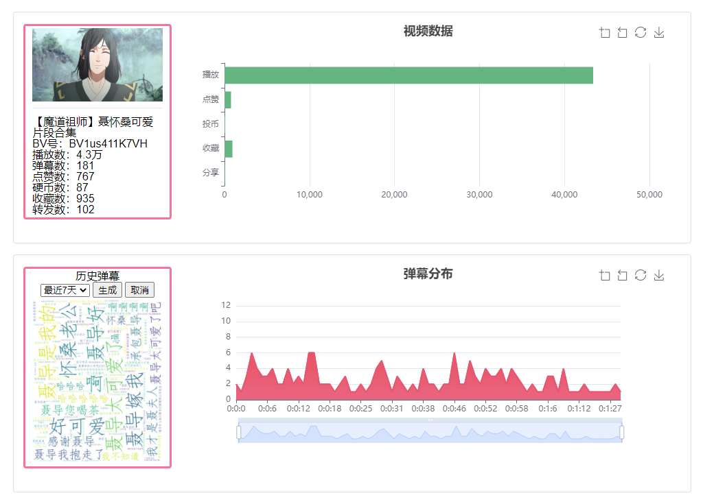

# bilibilivue-flask
---
## 简介
---
前后端分离式b站网站模拟+数据分析   
前端：vue2 + vuex + router + echart + webpack + ES6/7 + stylus + nginx  
后端：flaks + flask_restful + bulueprint + proxy_pool  
## 项目运行
---
**源码地址** <https://github.com/prc123/bilibilivue-flask>  
**码云地址**  
***
**如何运行**  
运行前请先安装`python`和`node.js`  
`clone`项目及项目子库到本地  
`git clone --recursive https://github.com/prc123/bilibilivue-flask.git `  
前端运行  
```
cd tempVue
npm install  
npm run dev  
```
后端运行
```
cd tempFlask
pip install --no-cache-dir -r requirements.txt 
国内源须加 -i https://pypi.tuna.tsinghua.edu.cn/simple/ 
python manager.py
```
为了确保运行正确，请先运行后端服务。再运行前端，之后访问 <http://localhost:8080>
## 结果
**主页面**

**分类橱窗**

**视频页面**

**视频数据可视化**  
***目前仍在开发中***

## 前端组件
根据首页的各模块的功能不同，划分出了共20多个可复用的组件。具体请看下方
```
├── banner  //轮播组件
│   ├── Banner.vue
│   └── BannerItem.vue
├── common  // 公共组件
│   ├── BHeader.vue
│   ├── BMenu.vue
│   ├── BMenuItem.vue
│   ├── PostMaterial.vue
│   ├── Search.vue
│   └── TopContainer.vue
├── content  // 主内容组件
│   └── BContent.vue
├── contentRow  // 单个分类的组件
│   ├── BContentRow.vue
│   ├── BRowBody.vue
│   ├── BRowHead.vue
│   ├── BRowItem.vue
│   ├── BRowRank.vue
│   └── BRowRankBody.vue
├── contentTop  // 页面顶部组件
│   ├── BContentTop.vue
│   └── BContentTopItem.vue
├── live  //直播所在的组件
│   ├── BLive.vue
│   ├── BLiveItem.vue
│   ├── BLiveRank.vue
│   └── BLiveRankItem.vue
├── nav  //右侧导航条组件
│   ├── BNavSide.vue
│   └── smooth-scroll.js
└── promote  // 推广组件
    ├── BPromote.vue
    └── BPromoteItem.vue
```
组件的原则就是尽量将复杂的UI布局划分成单个小的UI组件，逻辑处理也被划分成更多的单个小的逻辑。数据流动采用的单向数据流动。子组件的数据更多的是来自于父组件，父组件的数据主要是其本身发起的ajax请求。本项目中ajax请求库使用的是axios。

## 后端API
根据前端各模块功能，设置后端API接口，爬取B站相关数据，处理并返回。具体请看下方
```
      api
      ├── __init__.py
      ├── mainPage  // 主内容
      │   ├── __init__.py
      │   ├── models.py
      │   ├── urls.py
      │   └── view.py
      ├── userinfo //用户信息管理
      │   ├── __init__.py
      │   ├── models.py
      │   ├── urls.py
      │   ├── userinfo.py
      │   └── view.py
      └── videoPage //单个视频内容及分析
          ├── models.py
          ├── urls.py
          └── view.py
```
根据B站提供的各类API，编写爬虫库。具体请看下方
```
   ├── bilibili_api
   ├── about.json
   ├── app.py
   ├── article.py
   ├── audio.py
   ├── bangumi.py
   ├── channel.py
   ├── common.py
   ├── data
   │   ├── api.json
   │   ├── article_style.json
   │   ├── channel.json
   │   └── __init__.py
   ├── dynamic.py
   ├── exceptions.py
   ├── __init__.py
   ├── live.py
   ├── tools
   │   ├── article_style.css
   │   ├── build.py
   │   ├── __init__.py
   │   └── stat.py
   ├── user.py
   ├── utils.py
   └── video.py

```
## 性能优化
- 图片懒加载
- 浏览器缓存
- ip代理自动选取
- 缩减数据量
## 待优化
- 加速前端访问速度，对前端库进行CDN引入
- 优化页面数据响应方式，实现动态加载
- 对现有API进行缩减和合并
- 引入scrapy定时抓取数据，并获取用户数据
- 引入redis对数据缓存，加快数据响应速度

## 总结
B站网站模拟总体完成，接下来需引入数据的爬取及可视化。
